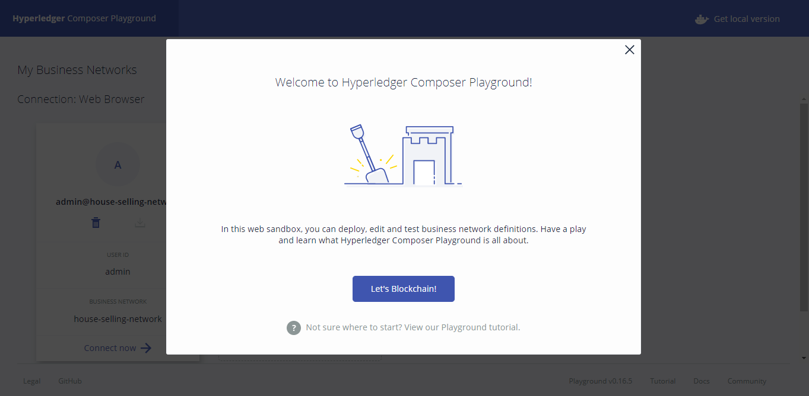
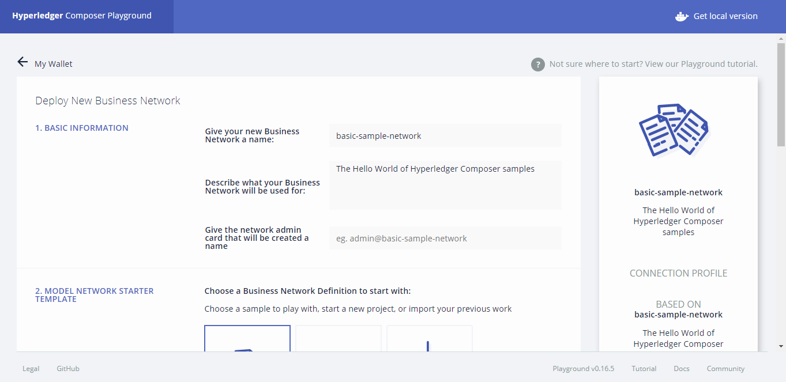
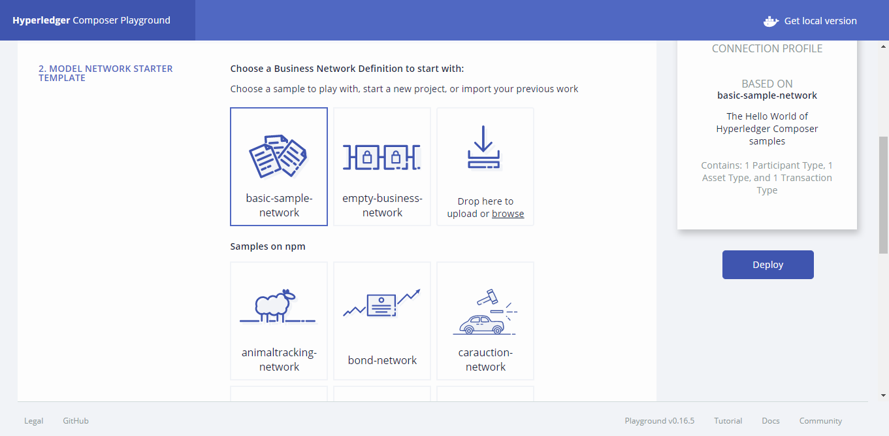

# Composer Workshop - ITESM CCM
---
Este proyecto fue hecho para propósitos educacionales y para el 'Blockchain Workshop' del
ITESM CCM.

El proyecto es una Red de Negocios de 'Blockchain' en Hyperledger Composer para vender casas.
La idea es que personas tienen una forma de verificar fácil y directamente quién es el dueño
de cada casa, de poner una casa a la venta y de crear acuerdos de compra. Todas las transacciones
son grabadas en el Blockchain de Fabric y son inmutables.

- Para más información acerca de [Hyperledger Composer](https://hyperledger.github.io/composer/latest/introduction/introduction.html).
- Para más información acerca de [Hyperledger Fabric](http://hyperledger-fabric.readthedocs.io/en/release/)

---
Detalles de los participantes:
#### Personas
```js
{
    "email": String, // ID
    "firstName": String,
    "lastName": String,
}
``` 
---
Detalles de los activos:
Los activos son los elementos que son intercambiados, modificados, leídos, etc por los participantes.
### Casas
```js
{
    "houseId": String,
    "houseAddress": {
        "street": String,
        "postCode": String,
        "colonia": String,
        "city": String
    },
    "price": Integer,
    "info": String[],
    "houseSize": String,
    "onSale": Boolean,
    "owner": Persona
}
``` 

### Acuerdo de venta
```js
{
    "seller": Persona,
    "buyer": Persona,
    "houseInSale": Casa
}
``` 
El acuerdo de venta es utilizado para poder realizar una transacción de venta entre dos participantes.
---
Detalles de las transacciones:
### Registrar casa para venta
```js
{
    "house": Casa
}
``` 
Permite que una casa esté disponible para venta.

### Venta de casa
```js
{
    "sA": Acuerdo de venta
}
``` 
Esta transacción se realiza cuando se quiere vender la casa, aquí se hace un cambio de "owner" dentro del activo
Casa.
---
## Prueba en Composer Playground
Playground es una herramienta de Hyperledger Composer para realizar pruebas visibles con las redes de negocio.
Se puede usar de manera local o de manera remota.
Para instalar de manera local puedes seguir este [tutorial](https://hyperledger.github.io/composer/latest/installing/installing-index).

Aquí veremos un breve tutorial para probar una red de manera remota.
1. Entra al siguiente [link](https://composer-playground.mybluemix.net/).

2. Da click en "Deploy a New Business Network".

3. Llena los datos que te pide: Nombre de la red, descripción y nombre de la tarjeta de adminitrador de red.
4. Selecciona el tipo de red que desees probar. Puede ser una ya creada, o subir tu propio archivo .bna.

5. Da click en "Deploy".
6. Diviértete.


